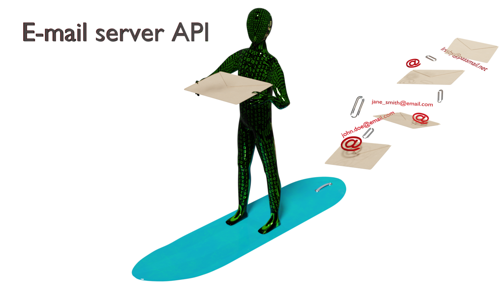

# Arbeidskrav: Mail Server using REST API




---

## What is this?
This is a university assignment. The task is to create a REST API for a mail server. The API should be able to create, read, update, and delete. It is not a full-fledged mail server, but a simple API that can be used to create users and retrieve them. Do not use this for anything but educational purposes. Passwords are handled in cleartext and there is no user authentication. To cite tech entusiasts from XDA:
> Your warranty is now void.   
> I am not responsible for bricked devices, dead SD cards, thermonuclear war, or you getting fired because the alarm app failed.   
> Please do some research if you have any concerns about features included in this ROM before flashing it!  
> YOU are choosing to make these modifications, and if you point the finger at me for messing up your device, I will laugh at you. [^xda]

Source: [^xda]: [XDA forums](https://xdaforums.com/t/funny-warnings.1896297/)

Needless to say, this quote is not for __this__ project, but for custom ROMs, but the spirit of the quote still stands as is.

## Assignment text:
<details>
  <summary>
    <b>Term assignment</b>: Mail Server using REST API</h5>
  </summary>
<h4>Spring Boot Mail Server REST API with PostgreSQL</h4>
<h5>Objectives:</h5>
<ol>
  <li>Learn how to set up a Spring Boot application with Maven</li>
<li>Implement RESTful web services with Spring</li>
<li>Use Spring Data JPA to integrate with a PostgreSQL database</li>
<li>Practice designing and implementing database entities and relationships</li>
</ol>

<h5>Requirements:</h5>
<ul>
  <li><strong>Java JDK 20 or above</strong></li>
<li><strong>Maven</strong> (for project management and build)</li>
<li><strong>Spring Boot</strong>(latest stable version)</li>
<li><strong>Spring data JPA</strong></li>
<li><strong>PostgreSQL</strong>(database)</li>
<li><strong>Lombok</strong>(optional, to reduce boilerplate code)</li>
</ul>

<h5>Assignment tasks:</h5>
<ol>
<li><strong>Project setup</strong></li>
  <ul>
    <li>Create a new Spring Boot project using Spring Initializr (https://start.spring.io/). Choose Maven as the build tool and include dependencies for Spring Web, Spring Data JPA, and PostgreSQL driver.</li>
  </ul>
<li><strong>Database configuration</strong></li>
  <ul>
    <li>Install PostgreSQL and create a new database for your application.</li>
<li>Configure your application to connect to the PostgreSQL database by updating <code>application.properties</code> with the correct database URL, username, and password.</li>
  </ul>
<li><strong>Model Definition</strong></li>
  <ul>
    <li>Define (at least) two main entities: <code>User</code> and <code>Email</code>. Consider adding more entities if you want.</li>
<li>Implement the necessary relationships between entities (e.g., one-to-many, many-to-many).</li>
<ul>
  <li>The <code>User</code> entity should include fields like <code>id</code> (primary key), <code>username</code>, <code>email</code>, <code>password</code>.</li>
<li>The <code>Email</code> entity should have fields such as <code>id</code> (primary key), <code>fromEmail</code>, <code>toEmail</code>, <code>subject</code>, <code>body</code>, <code>timestamp</code>.</li>
</ul>
<li>Use JPA annotations to map these entities to your PostgreSQL database tables.</li>
  </ul>
<li><strong>Repository Layer</strong></li>
    <ul>
        <li>Create JPA repositories for each entity to facilitate CRUD operations.</li>
    </ul>
<li><strong>Service Layer</strong></li>
    <ul>
        <li>Implement service classes to encapsulate the business logic for user and email management.</li>
    </ul>
<li><strong>Controller Layer</strong></li>
<ul>
  <li>Develop REST controllers to expose HTTP endpoints for managing users and emails.</li>
<li>Endpoints could include user creation, deletion, update, fetching user details, sending emails, listing received/sent emails, and email deletion.</li>
</ul>
<li><strong>Documentation</strong></li>
<ul>
<li>Document your REST API endpoints using tools like Swagger or Spring Rest Docs</li>
</ul>
</ol>

<h5>Submission Guidelines:</h5>
<ul>
<li>Ensure your code is well-structured, properly commented, and follows Java coding best practices.</li>
<li>Include a <code>README.md</code> file with setup instructions, including how to configure and start the PostgreSQL database, build and run your Spring Boot application, and any other relevant information.</li>
<li>Submit your project as a zip file or provide a link to a Git repository containing your Maven project.</li>
</ul>

<h5>Evaluation Criteria:</h5>
<ul>
<li>Correctness: Application functions according to the requirements.</li>
<li>Database Integration: Effective use of Spring Data JPA with PostgreSQL</li>
<li>Documentation: Clarity and completeness of documentation for using the API and setting up the project</li>
</ul>

<blockquote>Source: <a href="https://usn.instructure.com/courses/33298/assignments/114253?module_item_id=621513">Canvas: OBJ2100 Objektorientert programmering 2 25V Hønefoss </a></blockquote>
</details>

---

## Table of contents
<!-- TOC -->
* [Arbeidskrav: Mail Server using REST API](#arbeidskrav-mail-server-using-rest-api)
  * [What is this?](#what-is-this)
  * [Assignment text:](#assignment-text)
  * [Table of contents](#table-of-contents)
  * [Setup instructions](#setup-instructions)
  * [Create](#create-)
    * [Create a user `POST`](#create-a-user-post)
    * [Create email `POST`](#create-email-post)
  * [Retrieve](#retrieve)
    * [Retrieve all users `GET`](#retrieve-all-users-get)
    * [Retrieve a user by id `GET`](#retrieve-a-user-by-id-get)
    * [Retrieve all e-mails `GET`](#retrieve-all-e-mails-get)
    * [Retrieve e-mail by id `GET`](#retrieve-e-mail-by-id-get)
  * [Update](#update)
    * [Update user `PUT`](#update-user-put)
  * [Delete](#delete)
    * [Delete user `DELETE`](#delete-user-delete)
    * [Delete email `DELETE`](#delete-email-delete)
    * [Explanation of endpoints](#explanation-of-endpoints)
<!-- TOC -->

---


---

## Setup instructions
1. Clone the repository to your local machine.
2. Open the project in your favorite IDE (e.g., IntelliJ IDEA, Eclipse).
3. Make sure you have Java JDK 20 or above installed.
4. Make sure you have Maven installed.
5. Make sure you have PostgreSQL installed and running.
6. Create a new PostgreSQL database for the project.
7. Update the `application.properties` file with your PostgreSQL database connection details. For example:
   ```properties
   spring.datasource.url=jdbc:postgresql://localhost:5432/your_database_name
   spring.datasource.username=your_username
   spring.datasource.password=your_password
   ```
   The default one in this project is username=`postgres` and password=`password`. The database name is `mailserver`.
8. Run the application using your IDE or by executing the following command in the terminal:
   ```bash
   mvn spring-boot:run
   ```
   If this does not work, go to the root directory of the project and open a terminal in which you write:

    ```cmd
    .\mvnw.cmd spring-boot:run
    ```
   ... and hit Enter.

9. The application should start, and you can access the REST API at `http://localhost:8080/api/`.
10. You can use Postman or any other API testing tool to interact with the API endpoints.
11. You can also use the URL bar in your browser to retrieve information. This is not recommended for `POST`, `PUT`, or `DELETE` methods, but it works for `GET` methods.


## Create 
### Create a user `POST`

<details>
<summary>
Using Postman
</summary>

1. Open Postman and create a new HTTPS workspace if you don't already have one
2. We want to create a user so choose the <code>POST</code> label under the REST API basics: CRUD, test & variable dropdown menu.
3. Enter the URL http://localhost:8080/api/users in the address bar
4. In the body field, make sure raw JSON is selected.
5.
   ```json
   {
     "username": "john_doe",
     "email": "john_doe@email.com",
     "password": "password"
   }
   ```

6. Press the <code>Send</code> button.
   If you see the number <code>200</code> in a toast everything went as expected. If you see something else, something went wrong.

</details>

<details>
<summary>
Using the URL bar
</summary>

☝️🤓 This is unsupported and not recommended. You can only __retrieve__ (`GET`) information from the URL bar.

</details>

### Create email `POST`
<details>
<summary>Using Postman</summary>

1. Make sure you've chosen POST in your Postman workspace.
2. In the raw JSON, enter fields "fromEmail", "toEmail", "subject", and "body". Leave id and timestamp empty. For example:
    ```json
    {
        "fromEmail":"johndoe@email.com",
        "toEmail":"janesmith@email.com",
        "subject":"HOA Terms and conditions",
        "body":"Blablabla legal mumbojumbo see attachment"
    }
    ```
3. Hit Send.

   >You can only add one e-mail at a time. You can not add several e-mails at once. This is not supported.

</details>

## Retrieve

### Retrieve all users `GET`
<details>
  <summary>
  Using Postman
  </summary>

1. Make sure you have chosen GET in your Postman workspace.
2. Enter the URL http://localhost:8080/api/users in the address bar
3. Press the <code>Send</code> button.

</details>

<details>
  <summary>
  Using the URL bar
  </summary>

1. Open your browser and enter the URL http://localhost:8080/api/users in the address bar
2. Press enter.

</details>

### Retrieve a user by id `GET`

<details>
  <summary>
    Using Postman
  </summary>

1. Make sure you have chosen GET in your Postman workspace.
2. Enter the URL http://localhost:8080/api/users/{id} in the address bar
3. Replace {id} with the id of the user you want to retrieve.
4. Press the <code>Send</code> button.

</details>

<details>
  <summary>
    Using the URL bar
  </summary>

1. Open your browser and enter the URL http://localhost:8080/api/users/{id} in the address bar
2. Replace {id} with the id of the user you want to retrieve.
3. Press enter.

</details>

### Retrieve all e-mails `GET`
<details>
  <summary>
    Using Postman
  </summary>

1. Make sure you have chosen GET in your Postman workspace.
2. Enter the URL http://localhost:8080/api/emails in the address bar
3. Press the <code>Send</code> button.

</details>

<details>
  <summary>
    Using the URL bar
  </summary>

1. Open your browser and enter the URL http://localhost:8080/api/emails in the address bar
2. Press enter.
</details>

### Retrieve e-mail by id `GET`

<details>
<summary>Using Postman</summary>

1. Make sure you have chosen GET in your Postman workspace.
2. Enter the URL http://localhost:8080/api/emails/{id} in the address bar
3. Replace {id} with the id of the e-mail you want to retrieve.
4. Press the <code>Send</code> button.

</details>

<details>
<summary>Using the URL bar</summary>

1. Open your browser and enter the URL http://localhost:8080/api/emails/{id} in the address bar
2. Replace {id} with the id of the e-mail you want to retrieve.
3. Press enter.

</details>

## Update
### Update user `PUT`

<details>
<summary>
Using Postman
</summary>

1. Make sure you have chosen PUT in your Postman workspace.
2. Enter the URL http://localhost:8080/api/users/{id} in the address bar
3. Replace {id} with the id of the user you want to update.
4. In the body field, make sure raw JSON is selected.
5. Change the JSON fields to the new values you want to update. Leave the ID field.
6. Click Send.
</details>

<details>
<summary>
Using the URL bar
</summary>

You can only retrieve information from the URL bar, you can not `POST`, `PUT` or `DELETE`. Even on YouTube, this is the case. Let's try to change the title of someone's video. First we need the video ID. The arguments for YouTube are `watch`. Watch what? `v` for video. So `youtube.com/watch?v={videoID}` lets us watch that video. This equals the `GET` method. First we need to get the video-ID of the video we want to change the title of. Get the [video ID here](https://www.youtube.com/watch?v=dQw4w9WgXcQ). Then change the `watch` keyword to `edit` and hit enter.

</details>

## Delete

### Delete user `DELETE`
<details>
<summary>
Using Postman
</summary>

1. Copy the entry of the person you want to delete by using the GET method.
2. Make sure you have chosen the `DELETE` method.
3. Paste the information into the `Body` field. Like this:
    
   ```json
    {
      "id": 1,
      "username": "johndoe0",
      "email": "john_doe@email.com",
      "password": "password"
    }
    ```
   
    Note: You can not delete several entries at once. You can only delete one entry at a time.  
   

4. Hit Send.
</details>

<details>
<summary>
Using the URL bar
</summary>
Nope. Absolutely not. This is not allowed nor recommended.
</details>

### Delete email `DELETE`

<details>
<summary>
Using Postman
</summary>

1. Copy the entry of the email you want to delete by using the GET method.
2. Make sure you have chosen the `DELETE` method.
3. Paste the information into the `Body` field. Like this:

    ```json
    {
        "id": 3,
        "fromEmail": "johndoe@email.com",
        "toEmail": "janesmith@email.com",
        "subject": "RE:RE:HOA Terms and conditions",
        "body": "There is no need to send it anew, you already have it. The e-mail client uses the paperclip as a symbol of attachment. Please click the attachment, in which is the paperclip, in order to download the HOA terms and conditions.",
        "timestamp": "2025-04-09T15:50:10.814065",
        "sentAt": null,
        "receivedAt": null
    }
    ```
4. Hit Send.

> You can also copy the `localhost:8080/api/emails/{id}` and click Send after replacing the {id} with the id of the email you want to delete. This will delete the email with the id you specified. You can not delete several entries at once. You can only delete one entry at a time.

</details>

<details>
<summary>
Using the URL bar
</summary>
You can't.
</details>

### Explanation of endpoints

| HTTP method | Endpoint         | Description              | URL bar support |
|-------------|------------------|--------------------------|-----------------|
| POST        | /api/users       | Create a new user.       | No              |
| POST        | /api/emails      | Create a new email.      | No              |
| GET         | /api/users       | Retrieve all users.      | Yes             |
| GET         | /api/users/{id}  | Retrieve a user by id.   | Yes             |
| GET         | /api/emails      | Retrieve all emails.     | Yes             |
| GET         | /api/emails/{id} | Retrieve an email by id. | Yes             |
| PUT         | /api/users/{id}  | Update a user by id.     | No              |
| PUT         | /api/emails/{id} | Update an email by id.   | No              |
| DELETE      | /api/users/{id}  | Delete a user by id.     | No              |
| DELETE      | /api/emails/{id} | Delete an email by id.   | No              |


