# Brukerveiledning for REST API mail-server

# Innholdsfortegnelse

<!-- TOC -->
* [Brukerveiledning for REST API mail-server](#brukerveiledning-for-rest-api-mail-server)
* [Table of Contents](#table-of-contents)
  * [Oppsett](#oppsett)
  * [HTTP-metoder](#http-metoder)
    * [CREATE](#create)
      * [User](#user)
      * [Email](#email)
    * [READ](#read)
      * [User](#user-1)
      * [Email](#email-1)
    * [UPDATE](#update)
      * [User](#user-2)
      * [Email](#email-2)
    * [DELETE](#delete)
      * [User](#user-3)
      * [Email](#email-3)
<!-- TOC -->

## Oppsett
1. Klon [repositoriet fra GitHub](https://github.com/Scandiking/emailAPIserver), enten ved å bruke `git clone`-kommandoen eller ved å laste ned ZIP-filen.
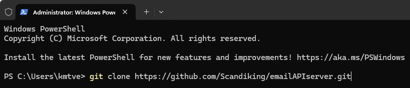  
2. Åpne prosjektet i din favoritt-IDE (f.eks. IntelliJ IDEA, Eclipse).
3. Åpne PostgreSQL og opprett en ny database for prosjektet.
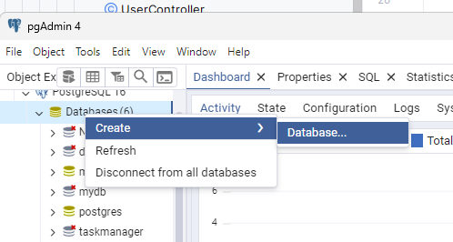  
Kall den mail_server.
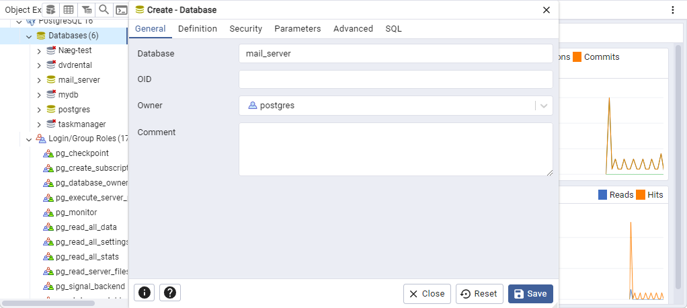  
4. Kjør programmet fra IDE-en din eller ved å bruke `mvn spring-boot:run`-kommandoen i terminalen.
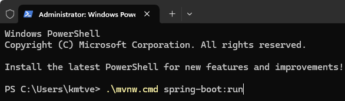

5. Sjekk at applikasjonen kjører ved å åpne nettleseren og navigere til `http://localhost:8080/`. Du bør se en velkomstmelding som sier "Welcome to the Mail Server" og viser en matrisemann på et surfebrett som holder en mail.
.png)
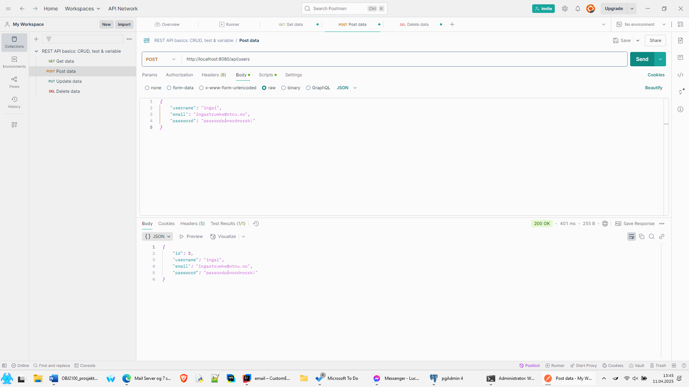
Note the `200 OK` message. This means the POST was successful.

#### Email
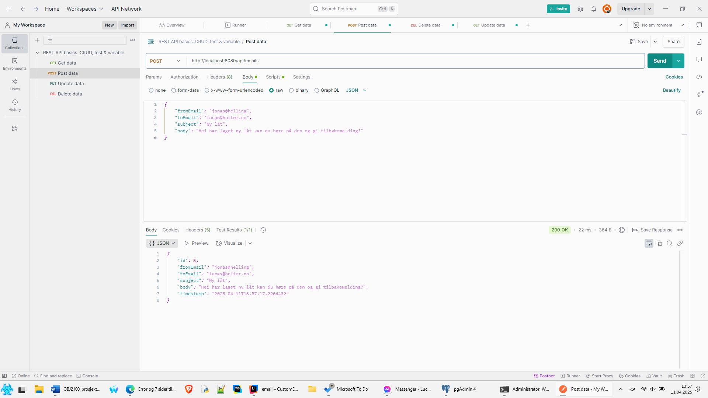

### READ
#### User
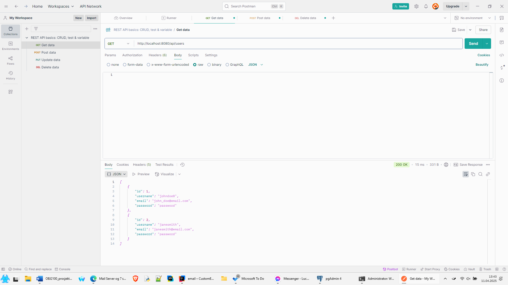

#### Email

### UPDATE
#### User
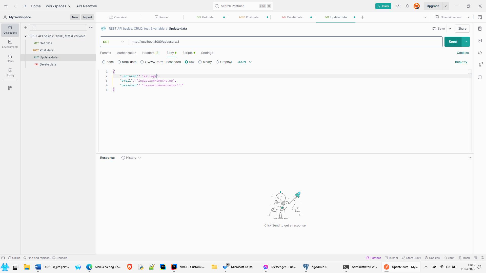

#### Email
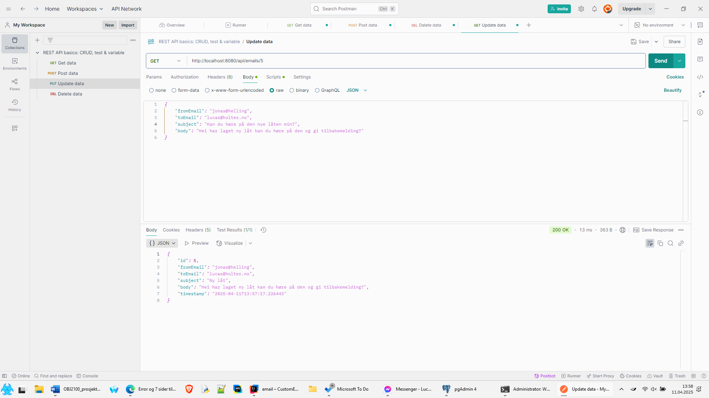

### DELETE

#### User
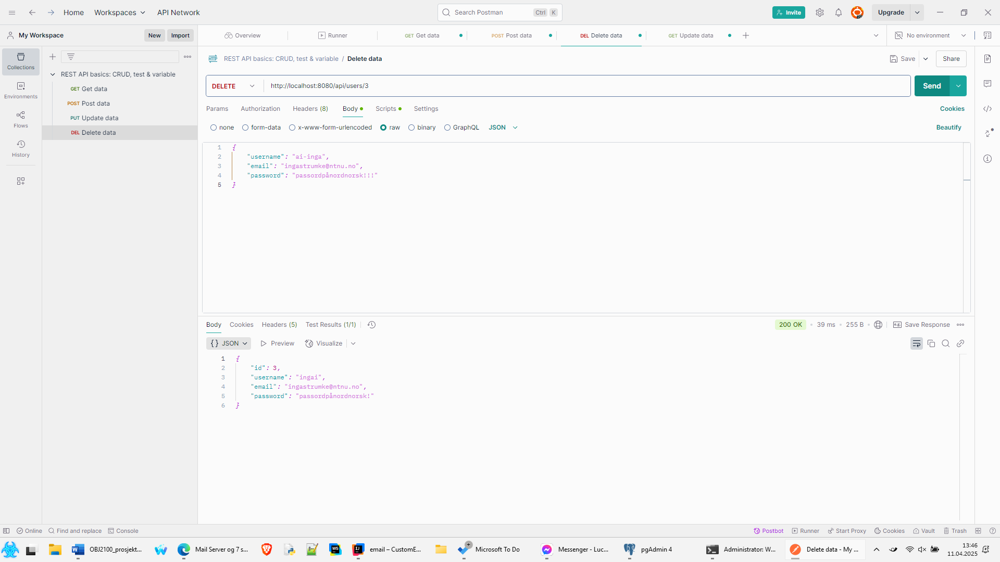
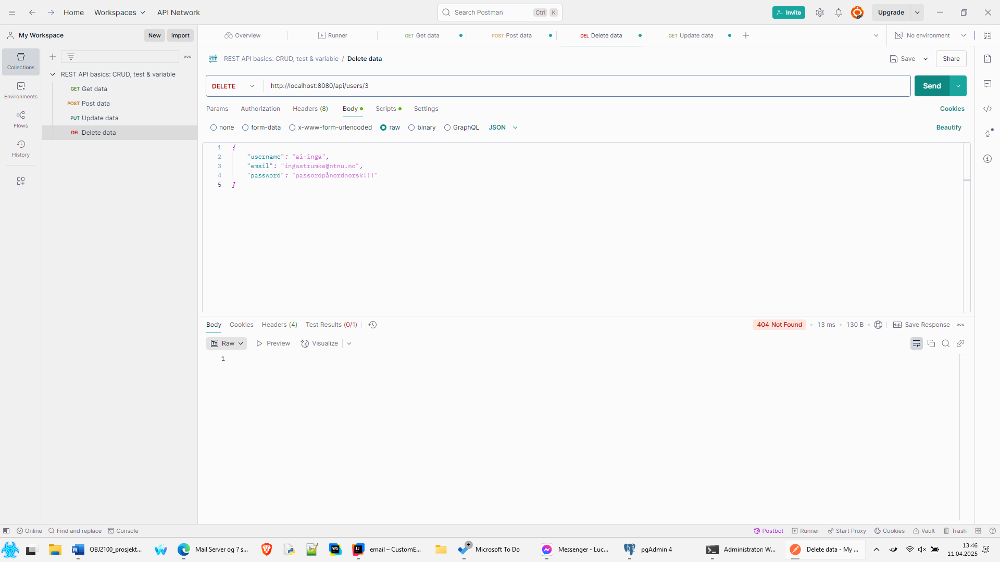
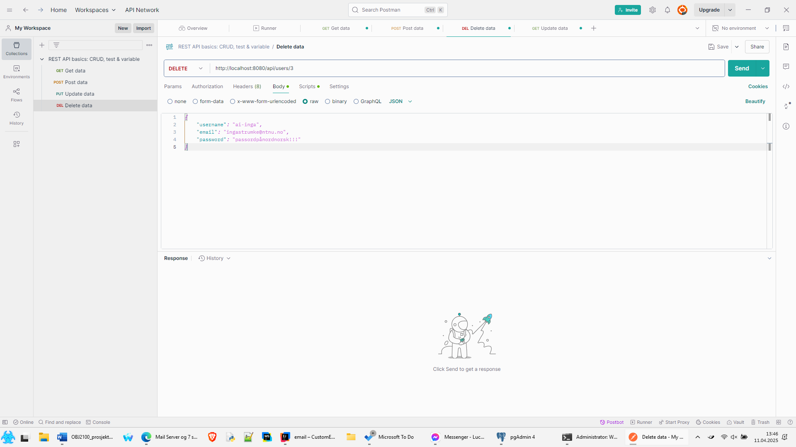

#### Email
